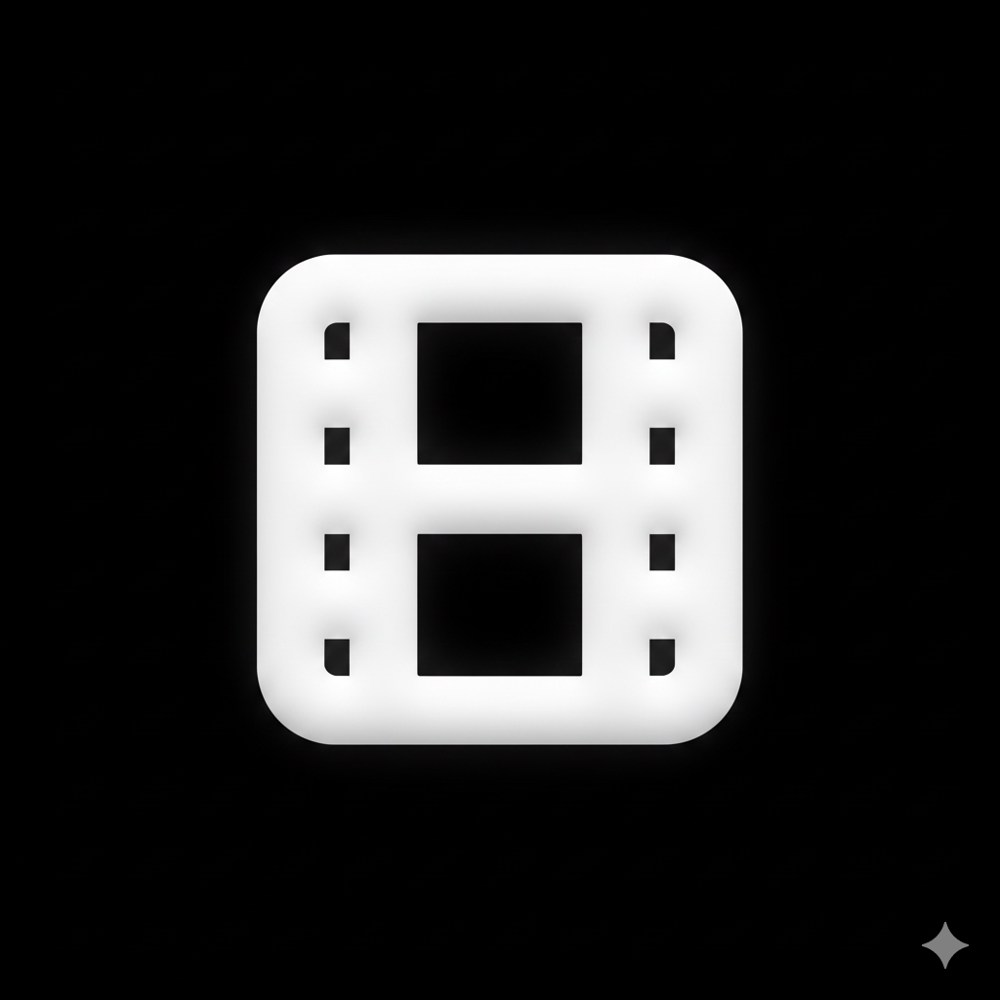

<div align="center">
  
  <h1>Reelspot</h1>
  <h3>The Ultimate Media Downloader for Creators</h3>
  
  <p>
    <a href="https://reelspot.vercel.app">View Demo</a>
    ·
    <a href="https://github.com/arshverma/REELSPOT/issues">Report Bug</a>
    ·
    <a href="https://github.com/arshverma/REELSPOT/pulls">Request Feature</a>
  </p>

  <p>
    
    
    
    
  </p>
</div>

<br />

## ✨ About The Project

**Reelspot** is a premium, high-performance web application designed to simplify media consumption for creators and minimalists. With a hyper-polished "obsidian glass" aesthetic, it offers a seamless experience for downloading high-quality videos from major social platforms without the clutter of traditional tools.

### Key Features

- **⚡ Multi-Platform Support**: Instantly download from **Instagram**, **YouTube**, **Facebook**, and **TikTok**.
- **💎 Premium Design**: A stunning, responsive UI built with **Tailwind CSS**, featuring glassmorphism, micro-interactions, and fluid 60fps animations.
- **🔒 Privacy First**: Your data stays yours. We use secure local storage and encrypted verified sessions. No tracking pixels or invasive ads.
- **📁 Smart History**: Automatically tracks your downloads with filtering, search, and bulk management capabilities.
- **🔌 Developer Friendly**: Open API architecture ready for extension.

---

## 🚀 Getting Started

To get a local copy up and running, follow these simple steps.

### Prerequisites

- Node.js (v18 or higher)
- npm or yarn

### Installation

1.  **Clone the repo**
    ```sh
    git clone https://github.com/arshverma/REELSPOT.git
    ```
2.  **Install dependencies**
    ```sh
    npm install
    ```
3.  **Configure Environment**
    Create a `.env` file based on `.env.example` and add your **Supabase** and **RapidAPI** keys.
    ```env
    VITE_SUPABASE_URL=your_url
    VITE_SUPABASE_ANON_KEY=your_key
    VITE_RAPIDAPI_KEY=your_key
    ```
4.  **Start the server**
    ```sh
    npm run dev
    ```

---

## 📚 Documentation

Comprehensive guides for both users and developers.

### 👤 User Guides

- [**Getting Started**](./docs/user/getting-started.md) - How to use Reelspot.
- [**API Keys Guide**](./docs/user/api-keys.md) - How to get your free API keys.
- [**Simulating Errors**](./docs/user/troubleshooting.md) - Troubleshooting common issues.
- [**Legal**](./docs/user/legal.md) - Privacy Policy & Terms.

### 💻 Developer Guides

- [**Architecture**](./docs/dev/architecture.md) - Codebase structure and design patterns.
- [**Database Schema**](./docs/dev/database.md) - Supabase table definitions.
- [**API Integration**](./docs/dev/api.md) - Adding new platforms.
- [**Deployment**](./docs/dev/deployment.md) - Build and deploy to Vercel/Netlify.

---

## 🤝 Contributing

Contributions are what make the open source community such an amazing place to learn, inspire, and create. Any contributions you make are **greatly appreciated**.

Please see [**CONTRIBUTING.md**](./CONTRIBUTING.md) for detailed guidelines.

---

## 👤 Author

**Arsh Verma**

- **Portfolio**: [arshcreates.vercel.app](https://arshcreates.vercel.app)
- **GitHub**: [@ArshVermaGit](https://github.com/ArshVermaGit)
- **LinkedIn**: [Arsh Verma](https://www.linkedin.com/in/arshvermadev/)
- **X (Twitter)**: [@TheArshVerma](https://x.com/TheArshVerma)

---

## 📄 License

Distributed under the **MIT License**. See `LICENSE` for more information.

<div align="center">
  <br />
  <p>Made with ❤️ by Arsh Verma</p>
</div>
