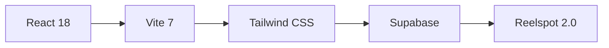

<div align="center">
  
  <h1>REELSPOT 2.0</h1>
  <p><i>The Ultimate Social Media Experience. Redefined.</i></p>

  <p>
    <a href="https://reelspot.vercel.app"><b>Live Experience</b></a> •
    <a href="https://github.com/ArshVermaGit/REELSPOT/releases"><b>Releases</b></a> •
    <a href="CONTRIBUTING.md"><b>Collaborate</b></a>
  </p>

  <p>
    
    
    
  </p>
</div>

---

### 💎 Philosophy

**Reelspot** isn't just a downloader; it's a statement on software aesthetics. Designed for creators who value precision, privacy, and performance. Version 2.0 introduces our most refined "Obsidian Glass" interface yet.

### ⚡ Core Pillars

- **Universal Flow**: Native-speed downloads from **Instagram**, **YouTube**, **TikTok**, and **Facebook**.
- **Privacy Zero**: No tracking, no cookies, no metadata leak. Your browsing is invisible.
- **Obsidian UX**: Hand-crafted 60fps micro-animations and a deep obsidian glass aesthetics.
- **Screaming Core**: A developer-first architecture built for extreme scalability and ease of contribution.

---

### 🛠️ The Stack


```mermaid
graph LR
    A[React 18] --> B[Vite 7]
    B --> C[Tailwind CSS]
    C --> D[Supabase]
    D --> E[Reelspot 2.0]
```

### 🚀 Quickstart

```bash
git clone https://github.com/ArshVermaGit/REELSPOT.git
cd REELSPOT
npm ci
npm run dev
```

---

### 🎨 Architecture

Reelspot 2.0 utilizes a **Strategy Pattern** for platform handling, ensuring that adding new social networks requires zero changes to the core engine.

- `src/services/platforms` — The heart of the extraction logic.
- `src/components/shared` — Atomic, reusable glassmorphism units.
- `src/data/info` — Dynamic content layer for extreme SEO control.

---

### 🤝 Join the Movement

We are building the future of media accessibility. Check our [**Roadmap**](./ROADMAP.md) or [**Changelog**](./CHANGELOG.md) to see what we've achieved.

<div align="center">
  <p>Crafted with obsession by <a href="https://github.com/ArshVermaGit"><b>Arsh Verma</b></a></p>
  <a href="#top">Back to top</a>
</div>

---

## ☕ Support the Project

If you find this tool helpful and want to support its development, consider buying me a coffee! Your support helps keep the project alive and free.

<div align="center">
    
<a href="https://www.buymeacoffee.com/ArshVerma">
  
</a>

</div>

## 📱 Connect with Me

I'd love to hear your feedback or discuss potential collaborations!

<div align="center">

[](https://github.com/ArshVermaGit)
[](https://www.linkedin.com/in/arshvermadev/)
[](https://x.com/TheArshVerma)
[](mailto:arshverma.dev@gmail.com)

</div>

---

<p align="center">
  Built with ❤️ by <strong>Arsh Verma</strong>
</p>

